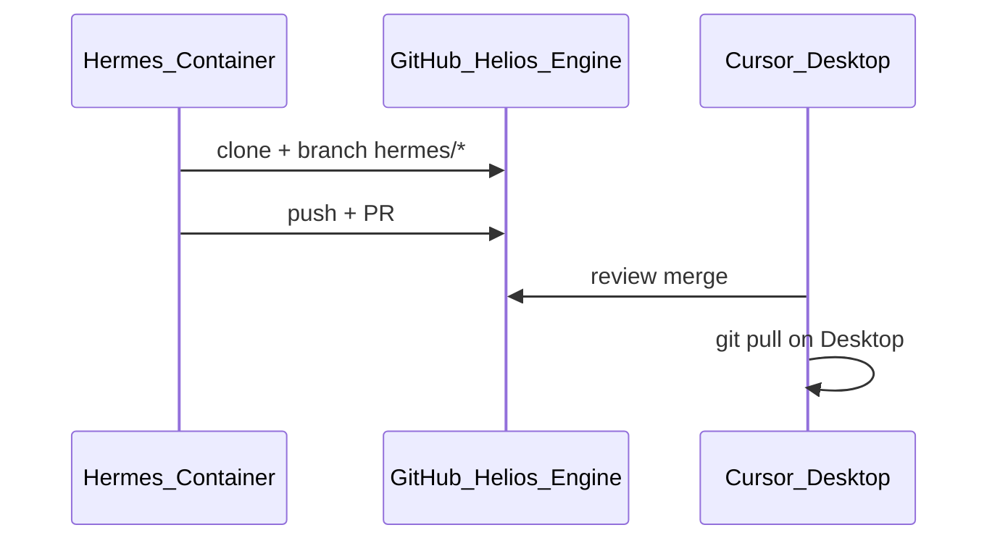

# Hermes Agent — GitHub Workflow

Use this instead of local BocaBurger folder copies or the Desktop golden path.

## Clone and branch

```bash
git clone https://github.com/bocaburger131/Helios-Engine.git
cd Helios-Engine
git checkout -b hermes/your-task-name
```

## Working directories

| Task | Path (container) | Path (local clone) |
|------|------------------|-------------------|
| API / validation / parsers | `/opt/data/workspace/Helios-Engine/bank-statement-analyzer-api/` | `bank-statement-analyzer-api/` |
| Dashboard UI | `/opt/data/workspace/Helios-Engine/helios-dashboard/` | `helios-dashboard/` |
| Start both locally | `node scripts/start-helios.js` (repo root) | same |

There is **no** `package.json` at repo root except the convenience `npm run dev` script. Run `npm install` inside each subproject.

## Hermes Docker auth (fine-grained PAT)

Hermes runs in `hermes-agent-official-compose` with `C:\BocaBurger\HermesData` mounted at `/opt/data`.

### 1. Create fine-grained PAT

https://github.com/settings/personal-access-tokens/new

| Setting | Value |
|---------|--------|
| Token name | `hermes-helios-engine` |
| Resource owner | `bocaburger131` |
| Repository access | **Only** `Helios-Engine` |
| **Contents** | Read and write |
| **Pull requests** | Read and write |
| **Metadata** | Read |

### 2. One-command setup (host)

```powershell
C:\BocaBurger\HermesScripts\setup-hermes-github.ps1 -Token github_pat_xxxxxxxx
```

This will:

- Set `GITHUB_TOKEN` and `GH_TOKEN` in `C:\BocaBurger\HermesData\.env`
- Ensure `docker_forward_env` includes those vars in `config.yaml`
- Restart the Hermes container
- Run `setup-git-auth.sh` inside the container (git credentials + clone)

Alternative: save token to `C:\BocaBurger\HermesData\.github-token` (one line) and run the script without `-Token`.

### 3. Config reference

```yaml
# C:\BocaBurger\HermesData\config.yaml
terminal:
  docker_forward_env:
    - GITHUB_TOKEN
    - GH_TOKEN
```

Boot hook `05-setup-git-auth` re-runs auth on container start when a token is present.

### 4. Verify inside container

```bash
docker exec hermes-agent-official-compose bash -lc \
  'git ls-remote https://github.com/bocaburger131/Helios-Engine.git HEAD && git -C /opt/data/workspace/Helios-Engine status -sb'
```

If `gh` is installed in the container: `gh auth status`.

## Before opening a PR

```bash
cd bank-statement-analyzer-api
npm run test:unit

cd ../helios-dashboard
npm test
```

## Pull request

- Target branch: `main`
- Title: `hermes: <short description>`
- Do not commit: `.env`, `uploads/`, `node_modules/`, `ruvector.db`, `.swarm/` memory DBs

## Docker / container mount

Mount the **git clone**, not Desktop or BocaBurger archives:

```bash
-v /opt/data/workspace/Helios-Engine:/workspace
```

Workdir: `/workspace/bank-statement-analyzer-api`

Do **not** mount `:ro` if the agent needs to write files for commits.

## Workflow


